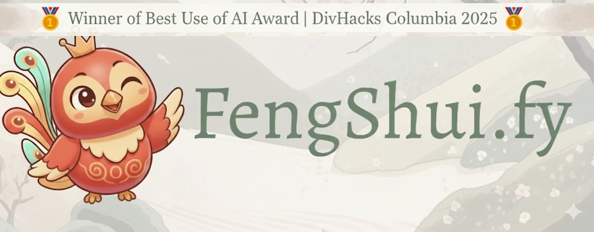
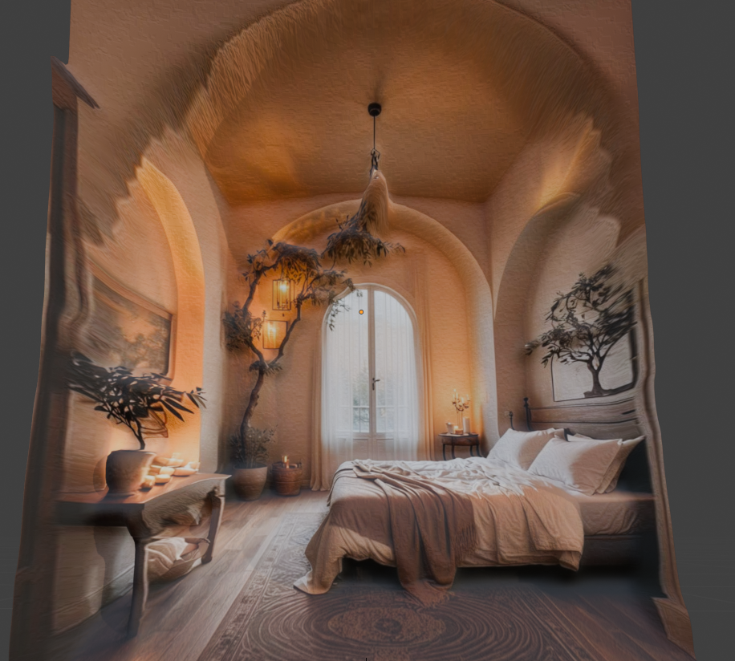

# FengShui.fy




An AI-powered interior design analysis platform that evaluates rooms using traditional feng shui principles combined with modern computer vision and generative AI.

<div align="center">
  
  <p><i>Example of generated 3D room model from uploaded photo</i></p>
</div>

## Overview

FengShui.fy transforms room photos into actionable feng shui insights by combining:

- **YOLOv11x Object Detection** - Identifies furniture and objects in your space
- **Gemini 2.5 Flash AI** - Analyzes feng shui principles and generates personalized recommendations
- **3D Model Generation** - Creates interactive 3D meshes from 2D photos using depth mapping
- **Interactive Tooltips** - Hover over detected objects to see specific feng shui insights
- **Zen-Inspired UI** - Calm, meditative design with graceful transitions

### Project Links

- [Demo Website](https://demo.fengshui.team/upload)
- [Devpost Project Page](https://devpost.com/software/fengshui-fy)

## Architecture

```
┌─────────────────────────────────────────────────────┐
│  FRONTEND (Next.js)          Port 3000              │
│  - Zen design system (slow transitions, soft UI)    │
│  - Auth0 authentication                             │
│  - Echo payment integration (3 free uploads)        │
└──────────────────┬──────────────────────────────────┘
                   │
                   │ HTTP/REST
                   ▼
┌─────────────────────────────────────────────────────┐
│  BACKEND (FastAPI)           Port 8000              │
│  - YOLOv11x object detection                        │
│  - Gemini 2.5 Flash feng shui analysis              │
│  - 3D model generation (background)                 │
└──────────────────┬──────────────────────────────────┘
                   │
                   │ HTTP
                   ▼
┌─────────────────────────────────────────────────────┐
│  BLENDER SERVICE             Port 5001              │
│  - TrueDepth Extractor plugin                       │
│  - Image → Depth Map → 3D Mesh → FBX               │
└─────────────────────────────────────────────────────┘
```

## Features

### 1. Feng Shui Analysis
Upload a room photo and receive:
- **Overall Score (1-10)** - Numerical feng shui rating
- **Strengths & Weaknesses** - Detailed analysis of positive and negative aspects
- **Actionable Suggestions** - Specific recommendations to improve energy flow
- **Object-Specific Tooltips** - Hover over detected furniture for targeted insights

### 2. Object Detection
Powered by YOLOv11x, the most accurate YOLO model:
- Detects up to 20 objects per image
- 0.25 confidence threshold for reliable results
- Annotated images saved for reference

### 3. 3D Room Modeling
Background generation of interactive 3D models:
- Converts 2D photos to depth maps
- Generates FBX mesh files
- View in embedded 3D viewer
- Status polling system (pending → processing → completed)

### 4. User Management
- **Auth0 Integration** - Secure Google OAuth login
- **Echo Payment System** - 3 free analyses, then $0.01 per upload
- **Paywall Toggle** - Testing mode available via localStorage

## Tech Stack

### Frontend
- **Framework**: Next.js 15.2.0 (App Router)
- **Language**: TypeScript
- **Styling**: TailwindCSS with custom zen theme
- **3D Rendering**: Three.js + React Three Fiber
- **Auth**: Auth0
- **Payments**: Echo SDK
- **State**: React hooks (useState/useEffect)

### Backend
- **Framework**: FastAPI
- **Language**: Python 3.10+
- **Object Detection**: Ultralytics YOLOv11x
- **AI Analysis**: Google Gemini 2.5 Flash
- **3D Generation**: Blender + TrueDepth Extractor plugin
- **Image Processing**: Pillow, OpenCV, NumPy

## Project Structure

```
fengshui.ai/
├── frontend/                 # Next.js App Router (TypeScript)
│   ├── app/
│   │   ├── page.tsx         # Landing page (breathing background)
│   │   ├── upload/page.tsx  # Main analysis page
│   │   └── viewer/page.tsx  # 3D model viewer
│   ├── components/          # React components
│   │   ├── FengShuiVisualization.tsx  # Interactive tooltips
│   │   ├── CircularProgress.tsx       # Score wheel
│   │   ├── Embedded3DViewer.tsx       # 3D model display
│   │   └── TopNav.tsx                 # Navigation
│   └── STYLE_GUIDE.md       # Design system rules
│
├── backend/                  # FastAPI (Python)
│   ├── main.py              # Main API server + /analyze endpoint
│   ├── object_detection.py  # YOLOv11x wrapper (singleton pattern)
│   ├── model_generation.py  # 3D generation via Blender service
│   ├── blender_service.py   # Blender subprocess manager
│   ├── results/             # Saved detection images + JSON
│   └── room_renders/        # Generated FBX files
│
├── data/                    # Test images and assets
├── .env                     # API keys (GOOGLE_API_KEY)
└── amnesia_codebase.md      # Developer onboarding guide
```

## Getting Started

### Prerequisites

```bash
# Python 3.10+
python --version

# Node.js 18+ and npm
node --version
npm --version

# Blender (for 3D generation)
blender --version
```

### Installation

1. **Clone the repository**
```bash
git clone <repository-url>
cd fengshui.ai
```

2. **Set up environment variables**
```bash
# Create .env file in root directory
echo "GOOGLE_API_KEY=your_gemini_api_key_here" > .env
```

3. **Install backend dependencies**
```bash
pip install -r backend/requirements.txt
```

4. **Install frontend dependencies**
```bash
cd frontend
npm install
```

5. **Install Blender TrueDepth Extractor plugin** (optional, for 3D generation)
- Follow plugin installation instructions for your Blender version

### Running the Application

**Terminal 1: Start Backend (includes Blender service auto-start)**
```bash
cd backend
python main.py
# or: uvicorn main:app --reload --port 8000
```

**Terminal 2: Start Frontend**
```bash
cd frontend
npm run dev
```

### Access Points

- **Frontend**: http://localhost:3000
- **Backend API Docs**: http://localhost:8000/docs
- **Blender Service Status**: http://localhost:5001/status

## API Endpoints

| Method | Endpoint | Description |
|--------|----------|-------------|
| `POST` | `/analyze/` | Upload image, get feng shui analysis + model_id |
| `GET` | `/models/status/{id}` | Check 3D generation status |
| `GET` | `/models/{filename}` | Download generated FBX file |

### Example Response

```json
{
  "score": 8,
  "overall_analysis": "Your room has good energy flow with excellent natural light placement...",
  "strengths": [
    "Natural light from east-facing windows promotes morning energy",
    "Bed positioned in commanding position"
  ],
  "weaknesses": [
    "Mirror directly facing bed may disrupt sleep energy"
  ],
  "suggestions": [
    "Consider moving mirror to adjacent wall",
    "Add plants in southeast corner for wealth energy"
  ],
  "tooltips": [
    {
      "object_class": "bed",
      "object_index": 0,
      "type": "good",
      "message": "Bed placement promotes restful sleep and security",
      "coordinates": { "bbox": {...}, "center": {...} }
    }
  ],
  "model_3d": {
    "model_id": "20251004_123456_789012",
    "status": "pending"
  }
}
```

## Design Philosophy

FengShui.fy follows a **zen, calm, and meditative** design language:

- **Slow Transitions**: 1000ms for page changes, 500ms for interactions
- **Color Palette**: zen-sage (green), zen-pine (dark green), zen-cloud (cream)
- **Generous Spacing**: `space-y-12` between sections
- **Soft Corners**: `rounded-2xl`, `rounded-3xl`, `rounded-full`
- **Light Typography**: `font-light` by default, serif for headings
- **Layered Shadows**: Soft but present (`shadow-lg`, `shadow-2xl`)

See `frontend/STYLE_GUIDE.md` for complete design system documentation.

## Development

### Common Tasks

**Modifying Feng Shui Analysis**
1. Update prompt in `backend/main.py` → `call_gemini_fengshui()`
2. Adjust response schema in `AnalysisResult` interface
3. Update UI rendering in `frontend/app/upload/page.tsx`

**Adjusting Object Detection**
1. Modify confidence/max_det in `backend/object_detection.py`
2. Results auto-save to `backend/results/`

**Changing 3D Generation Quality**
1. Model: `'vits'` (fast) → `'vitb'` → `'vitl'` (accurate)
2. Detail: Adjust `detail=10` parameter (5-50 range)

**UI Design Changes**
1. Always read `frontend/STYLE_GUIDE.md` first
2. Use existing Tailwind classes matching zen aesthetic
3. Keep transitions slow (500-1000ms minimum)

### Code Style

**Backend (Python)**
- Singleton pattern for heavy objects (YOLO model, generators)
- Async/await for background tasks
- Comprehensive logging with `logger.info()`
- Type hints everywhere

**Frontend (TypeScript)**
- `"use client"` for all interactive components
- Parallel tool calls for file operations
- Fade transitions on mount/unmount
- Descriptive state variable names

## Troubleshooting

**3D Generation Not Working?**
- Check: http://localhost:5001/status returns 200
- Verify TrueDepth Extractor plugin installed in Blender
- Review backend logs for Blender service messages

**YOLO Model Not Loading?**
- First run downloads `yolo11x.pt` (~220MB)
- Verify `backend/yolo11x.pt` exists

**Gemini API Errors?**
- Confirm `GOOGLE_API_KEY` in `.env` file
- Check quota: https://aistudio.google.com/app/apikey

**Slow Transitions?**
- This is intentional - part of zen design philosophy
- Do not reduce below 500ms (violates design principles)

## Philosophy

FengShui.fy balances three elements:
- **Modern AI** (YOLO, Gemini, depth mapping)
- **Ancient Wisdom** (feng shui principles)
- **Zen Aesthetics** (slow, flowing, breathing UI)

When in doubt, ask: "Does this feel calm and harmonious?"

## License

See the `LICENSE` file for details.

---

**Built with modern AI and ancient wisdom**
